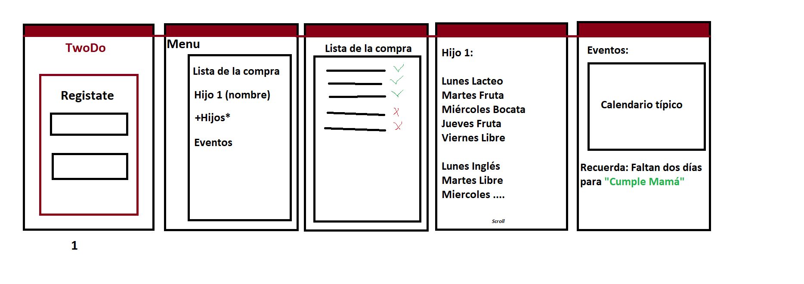

# TwoDo

  
  
  

> App Android para que una pareja comparta listas de la compra, horarios de los niños y fechas importantes, y no se le olvide nada.

Proyecto anual del módulo **Programación Multimedia y Dispositivos Móviles (PMDM)**.

---

## El problema

«¿Has cogido la lista de la compra?», «¿A qué hora salía de natación?», «¿Qué merienda toca hoy?». Hoy estas dudas se resuelven a base de mensajes, llamadas o volviendo a casa a por la lista. TwoDo reúne toda esa información en un solo sitio, compartido y siempre actualizado para los dos.

## Funcionalidades

**Imprescindibles**

- [ ] Alarmas y calendario de fechas importantes
- [ ] Lista de la compra
- [ ] Funcionamiento sin conexión

**Opcionales**

- [ ] Plantillas distintas para cada hijo
- [ ] Alarmas automáticas antes de cada actividad (por ejemplo, aviso cinco minutos antes de la salida)
- [ ] Compartir los datos con la pareja en tiempo real
- [ ] Agenda de los niños

## Pantallas

| Pantalla | Para qué sirve |
|---|---|
| Inicio | Registro y acceso al resto de secciones |
| Lista de la compra | Añadir productos y tacharlos al cogerlos |
| Tareas de los hijos | Horarios, actividades, entregas y meriendas |
| Calendario | Fechas importantes para los dos |

## Bocetos

## Requisitos del módulo

| Requisito | Cómo se cumple en TwoDo |
|---|---|
| Persistencia de datos | Listas, actividades, fechas y alarmas se guardan en el dispositivo |
| Servicio web | Sincronización con un servidor para compartir los datos con la pareja |
| Sensor o localización | Recordatorio al llegar al supermercado habitual |
| Contenido multimedia | Fotos para confirmar una recogida o mostrar un producto concreto |

## Documentación

Toda la documentación del proyecto está en la carpeta [`Docs`](Docs):

- [Propuesta del proyecto](Docs/plantilla-proyecto-a.md)
- [Comparación de tecnologías](Docs/0101_tech_comparasion.md)
- [Plan de despliegue](Docs/0102_rollout.md)
- [Restricciones de dispositivos](Docs/0103_device_constrains.md)

## Cómo abrirlo

1. En Android Studio, ve a **File → New → Project from Version Control**.
2. Pega la dirección de este repositorio y pulsa **Clone**.
3. Espera a que termine la sincronización de Gradle y ejecuta la app en un emulador o dispositivo.

## Autor

[@MauroGins](https://github.com/MauroGins)

## Actualizaciones
- 6 de Octubre de 2026
